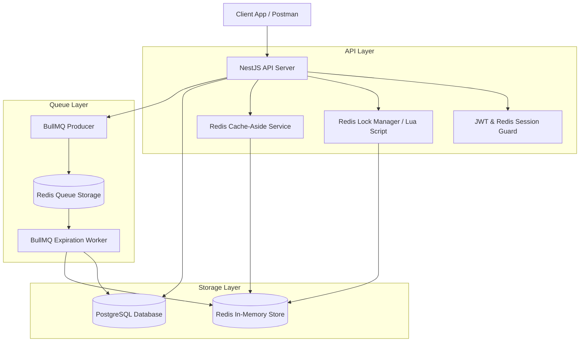
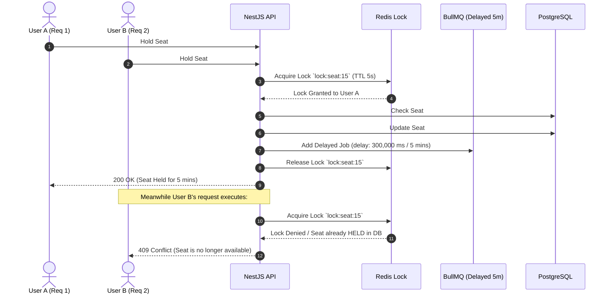
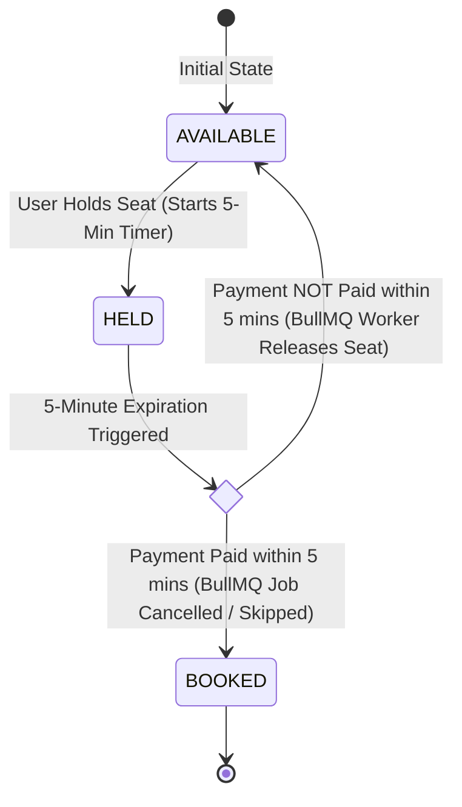

# System Architecture & Technical Design - Concurrency Ticket Booking API

> **System Blueprint**: Complete architectural design for handling high-concurrency seat locking, 5-minute timeout queues, and Redis caching.

---

## 1. High-Level Architecture Overview



---

## 2. Concurrency & Locking Strategy (Double-Booking Solution)

High-concurrency ခေါ် ပွဲလက်မှတ် Flash Sale များတွင် ခုံတစ်ခုံထဲကို လူအများအပြား တစ်ပြိုင်နက် နှိပ်သည့်အခါ **Race Condition** မဖြစ်စေရန် 2-Layer Defense Strategy ကို သုံးပါမည်။



### Locking Mechanisms Explained

1. **Redis Atomic Gatekeeper (`SET key token NX PX timeout`)**:
   - Fast lock memory level တွင် စစ်ဆေးခြင်းဖြစ်သည် (Execution < 2ms)။
   - simultaneous requests အများကြီး ဝင်လာရင် Redis ၏ Single-Threaded Atomic Nature ကြောင့် request ၁ ခုတည်းသာ lock ရမည်။

2. **PostgreSQL Row Locking (`SELECT FOR UPDATE` or Optimistic Lock)**:
   - Database level တွင် `Seat` Row ကို `HELD` ဟု မပြောင်းမီ status သေချာစစ်ခြင်း။

---

## 3. 5-Minute Seat Hold & Auto-Release Flow (BullMQ Delayed Job)

အဘယ်ကြောင့် Redis Key Expiration (Pub/Sub) ထက် **BullMQ Delayed Queue** ကို ပိုမို ရွေးချယ်သင့်သနည်း?
- Redis Pub/Sub သည် Guaranteed Delivery မရှိပါ။ Network ငြိရင် Expiration Event လွတ်သွားနိုင်သည်။
- BullMQ သည် Persistence ရှိပြီး Redis crash သွားလျှင်ပင် Job မပျောက်ဘဲ Exact 5 မိနစ် ပြည့်ပါက Reliable စွာ Seat ကို auto-release လုပ်ပေးနိုင်သည်။



---

## 4. Database Schema (Entities & Relationships)

### Entity: User
```typescript
interface User {
  id: string; // UUID
  email: string;
  passwordHash: string;
  name: string;
  createdAt: Date;
}
```

### Entity: Event
```typescript
interface Event {
  id: string;
  title: string;
  description: string;
  venue: string;
  eventDate: Date;
  totalSeats: number;
}
```

### Entity: Seat
```typescript
enum SeatStatus {
  AVAILABLE = 'AVAILABLE',
  HELD = 'HELD',
  BOOKED = 'BOOKED',
}

interface Seat {
  id: string;
  eventId: string;
  seatNumber: string; // e.g. "A-12"
  price: number;
  status: SeatStatus;
  heldByUserId?: string;
  heldUntil?: Date; // Current Time + 5 Minutes when status is HELD
  version: number; // Optimistic locking version
}
```

### Entity: Booking
```typescript
enum BookingStatus {
  PENDING = 'PENDING',
  CONFIRMED = 'CONFIRMED',
  EXPIRED = 'EXPIRED',
  CANCELLED = 'CANCELLED',
}

interface Booking {
  id: string;
  userId: string;
  seatId: string;
  amount: number;
  status: BookingStatus;
  expiresAt: Date;
  createdAt: Date;
}
```

---

## 5. API Endpoints Specification

### Auth Module
- `POST /api/v1/auth/register` - Create account
- `POST /api/v1/auth/login` - Authenticate & get JWT + Redis session

### Event Module
- `GET /api/v1/events` - List active events
- `GET /api/v1/events/:id/seats` - List seats for an event (Cached via Redis)

### Reservation & Concurrency Module
- `POST /api/v1/seats/:id/hold` - Atomic lock seat for 5 mins (Enqueue BullMQ expiry job)
- `POST /api/v1/bookings/checkout` - Confirm payment & transition seat status `HELD` -> `BOOKED`
- `GET /api/v1/bookings/my-bookings` - User's booking history
